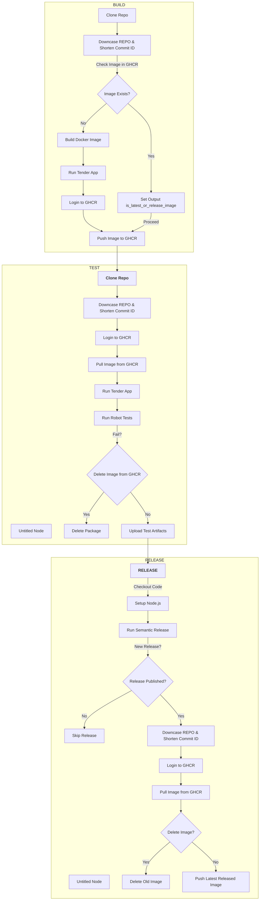

### main.yml

```mermaid
flowchart TD
 subgraph s1["BUILD"]
        n2["Clone Repo"]
        C["Downcase REPO & Shorten Commit ID"]
        D{"Image Exists?"}
        E["Set Output is_latest_or_release_image"]
        F["Build Docker Image"]
        G["Run Tender App"]
        H["Login to GHCR"]
        I["Push Image to GHCR"]
  end
 subgraph s2["TEST"]
        n3["Untitled Node"]
        J["<b>Clone Repo</b>"]
        K["Downcase REPO & Shorten Commit ID"]
        L["Login to GHCR"]
        M["Pull Image from GHCR"]
        N["Run Tender App"]
        O["Run Robot Tests"]
        P{"Delete Image from GHCR"}
        Q["Delete Package"]
        R["Upload Test Artifacts"]
  end
 subgraph s3["RELEASE"]
        n4["Untitled Node"]
        S["<b>RELEASE</b>"]
        T["Setup Node.js"]
        U["Run Semantic Release"]
        V{"Release Published?"}
        W["Skip Release"]
        X["Downcase REPO & Shorten Commit ID"]
        Y["Login to GHCR"]
        Z["Pull Image from GHCR"]
        AA{"Delete Image?"}
        AB["Delete Old Image"]
        AC["Push Latest Released Image"]
  end
    C -- Check Image in GHCR --> D
    D -- Yes --> E
    D -- No --> F
    F --> G
    G --> H
    H --> I
    E -- Proceed --> I
    I --> J
    J --> K
    K --> L
    L --> M
    M --> N
    N --> O
    O -- Fail? --> P
    P -- Yes --> Q
    P -- No --> R
    R --> S
    S -- Checkout Code --> T
    T --> U
    U -- New Release? --> V
    V -- No --> W
    V -- Yes --> X
    X --> Y
    Y --> Z
    Z --> AA
    AA -- Yes --> AB
    AA -- No --> AC
    n2 --> C

```

